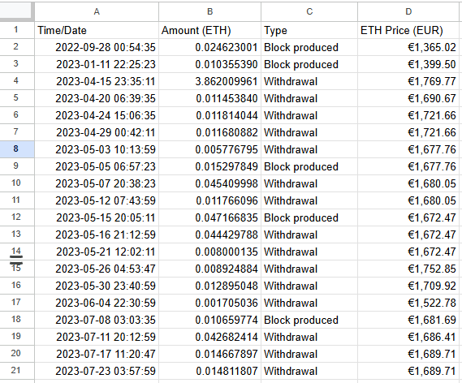

# Ethereum Validator Rewards Tracker

<p align="center">
  
  
</p>

Automated tracking of Ethereum validator rewards with historical price data for tax and accounting using google sheets.

This Google Apps Script fetches your validator inflows (beacon-chain withdrawals and execution-layer block rewards) via Etherscan and matches each event with accurate historical ETH prices from Kraken, writing everything into Google Sheets in your preferred fiat currency.

---

## Overview
All beacon-chain inflows for your validator or wallet are written to a single google sheets tab with four columns: Time/Date, Amount (ETH), Type, and ETH Price. The sheet is sorted by timestamp ascending.

## Features
- Withdrawals (consensus layer) via Etherscan v2
- Block rewards (execution layer) via mined blocks + block reward endpoints
- Historical ETH prices in your chosen currency from Kraken
- Simple menu entry in Sheets for quick refresh

## Requirements
- A Google Sheet you control
- An Etherscan API key (free is fine)
  - Create one in Etherscan → Profile → API Keys
- Your Ethereum addresses:
  - Withdrawal address (where beacon-chain withdrawals land)
  - Fee recipient (coinbase) address used by your validator for EL payouts (often the same, but not always)
- Validator index(es) are not required

## Setup

### Create your Sheet
1. Create a new Google Sheet (or use an existing one).
2. Add a tab named exactly: `BeaconChainInflows`.
3. Open Extensions → Apps Script.

### Add the script and configure
1. In Apps Script, paste the project code (GetRewards).
2. At the top of the script, set these constants:

```javascript
// Required
const SHEET_NAME = 'BeaconChainInflows';
const WALLET_ADDRESS = '0x...'; // your withdrawal (execution) address
const FEE_RECIPIENT_ADDRESS = '0x...'; // your fee recipient (coinbase) address
const ETHERSCAN_API_KEY = 'YOUR_ETHERSCAN_API_KEY';

// Pricing config (optional - defaults to EUR)
const PRICE_CURRENCY = 'eur'; // 'eur', 'usd', 'gbp', 'jpy', 'cad', 'aud', 'chf'
```

Notes:
- If you’re unsure whether the fee recipient equals the withdrawal address, check your validator client config or a block explorer for proposed blocks and use that address for `FEE_RECIPIENT_ADDRESS`.

## Price source (Kraken)
Prices in column D are fetched from Kraken’s public OHLC API (no key required):
- Free and reliable; works well with Apps Script
- Direct pairs supported: ETH/EUR, ETH/USD, ETH/GBP, ETH/JPY, ETH/CAD, ETH/AUD, ETH/CHF
- Other currencies use ETH/USD with real-time FX conversion

Adaptive intervals ensure good coverage and precision across history:
- 0–30 days: hourly candles
- 30 days–2 years: daily candles
- 2+ years: weekly candles (covers long histories)

Each event is matched to the nearest available price timestamp.

## Run it
1. In Apps Script, select the function `BeaconChainInflows_refresh`.
2. Click Run and authorize when prompted.
3. Return to Sheets; you’ll see rows with:
   - Time/Date
   - Amount (ETH)
   - Type = "Withdrawal" or "Block produced"

A custom menu “Beacon Chain” → “Refresh inflows” is also added for quick manual refreshes.

## Optional: schedule auto-refresh
1. In Apps Script, click Triggers (clock icon).
2. Add Trigger → choose function `BeaconChainInflows_refresh`.
3. Event source: Time-driven → select your preferred frequency (e.g., Hour timer).

## Troubleshooting
- Empty sheet?
  - Ensure `ETHERSCAN_API_KEY` is set and valid.
  - Double-check `WALLET_ADDRESS` (withdrawals) and `FEE_RECIPIENT_ADDRESS` (block payouts).
  - View → Logs to inspect API responses and errors.
- Warning “You are using a deprecated V1 endpoint”?
  - This script uses Etherscan v2 where available; verify your API key and mainnet selection.
- Missing expected block-produced entries?
  - Your fee recipient may differ from your withdrawal address; set `FEE_RECIPIENT_ADDRESS` accordingly.
  - If you’ve proposed many blocks, increase pagination in `listMinedBlocks` or loop pages.

## What gets recorded
- Withdrawals: consensus-layer withdrawals to `WALLET_ADDRESS` (Gwei → ETH).
- Block produced: execution-layer block reward (incl. tips) to `FEE_RECIPIENT_ADDRESS` (Wei → ETH).
- ETH Price (`PRICE_CURRENCY`): historical price from Kraken (hourly/daily/weekly) matched to the nearest event timestamp.


